# Miladycraft Installation Guide: OSX

**MILADYCRAFT NEW USER INSTALL GUIDE FOR WINDOWS:**

_**“It’s so simple even an e-girl can do it!”**_

**1:** To begin your Miladycraft installation adventure, please visit [https://miladycraft.net/](https://miladycraft.net/) and click the text on the big button that says **Install Miladycraft Latest Version.**\
.png>)

**2:** The link that opens is a MediaFire download site that hosts the latest version of Miladycraft. Click the blue button that says **Download.**

.png>)

**3:** Find the file in your Downloads folder and double-click it to un-zip. Wait a few minutes and a folder will appear called **Miladycraft 1.5**.

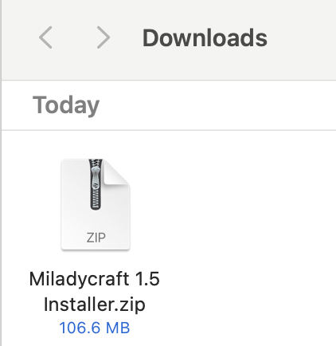.png>)

**4:** Open **Miladycraft 1.5 Installer** then open the folder that says **Mac.**

**5:** Right click the file that says **Miladycraft Installer.pkg** and select _Open._ If a prompt comes up asking if you're sure about opening the file, click _Open_.

<figure><figcaption></figcaption></figure>

**6:** Click _Next_ on the Setup Wizard!

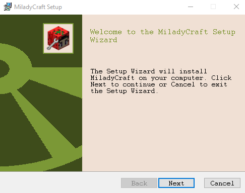

**7:** Check the _Accept Box_ for the End-User License Agreement and click _Next._

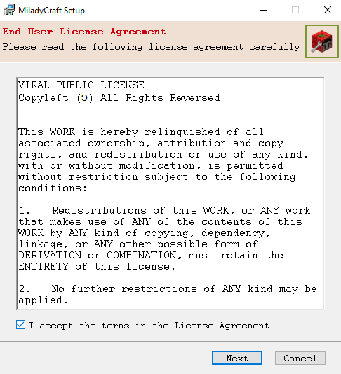

**8:** Click _Install._

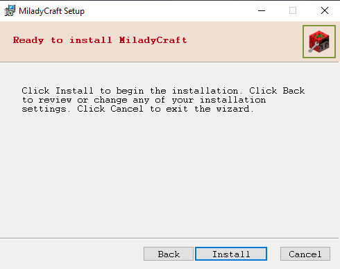

**9:** A window looking something like this will pop up. This is the launcher program we use for Miladycraft. The file is already loaded into the import section, just click **OK** at the bottom.

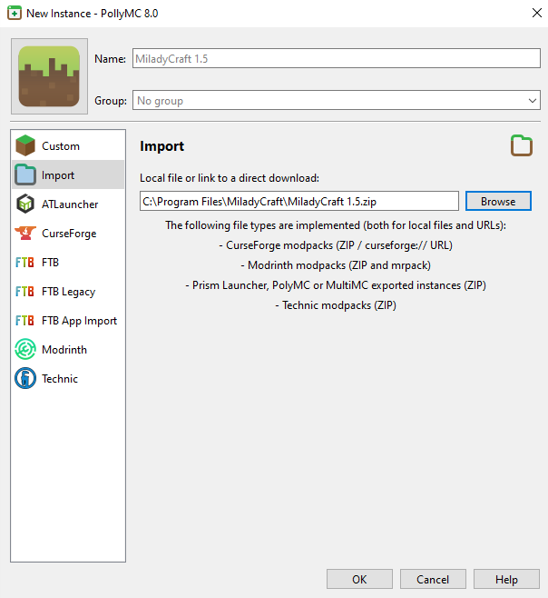

**10:** This is the main page of the Miladycraft launcher. In the top right corner, click **Accounts**, with the little black and white smiley face.

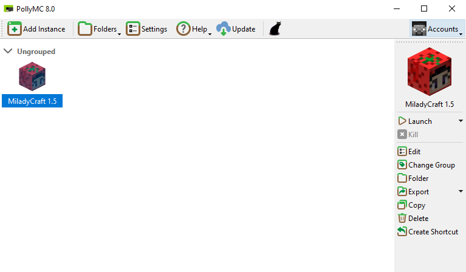

**11:** In the menu that pops open, click **Manage Accounts…**\
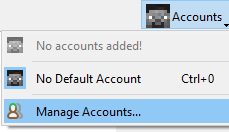

**12:** Even if you have a Mojang/Microsoft account for Minecraft already, just click **Add Offline** on the right side of the page that opens.

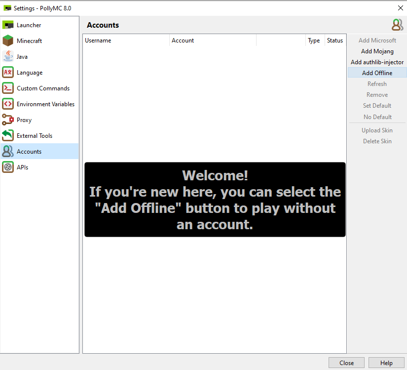

**13:** Enter the Username you want for your account. **DO **_**NOT**_** CHECK THE** _“Allow long usernames”_ **BOX.** This will make it impossible for you to join the server if your username is too long. Click **OK** when you’re finished.\
_(If you have a username someone else has taken, the server will not allow you in without their password, so you can always come back to this menu and pick a new username.)_

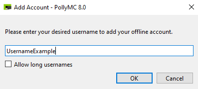

**14:** Once your username is created, it’ll show up in the Accounts section with a little checkmark showing that’s the account you’ve selected. Click **Close** at the bottom to go back to the main menu.

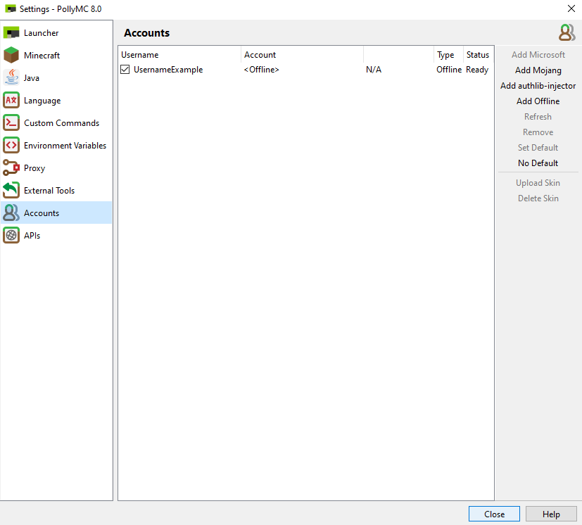

**15:** Back on the main menu, you’ll see that your account is selected now because your username appears in the top right corner. Make sure you have _Miladycraft 1.5_ selected (it’ll be highlighted in blue). If it’s not, just click on it to make sure it’s highlighted. Then, go to the right and click **Launch.**\
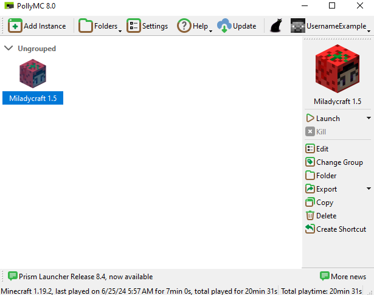

**16:** Sit back and relax, this is gonna take a couple minutes. You’ll see various loading bars while Miladycraft retrieves and loads the entire game for the first time…

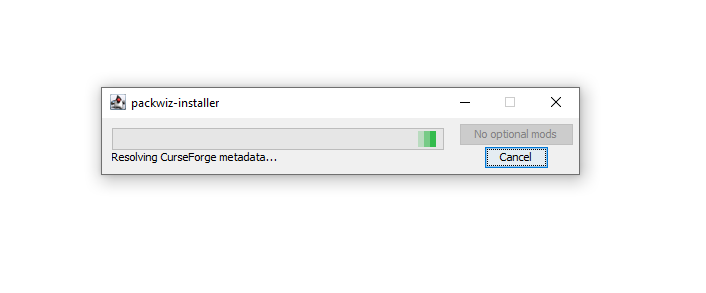

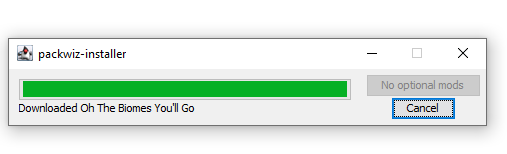 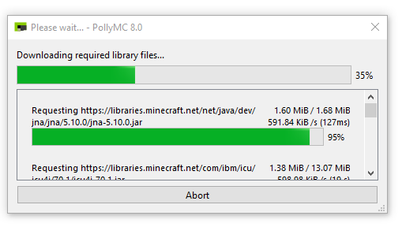

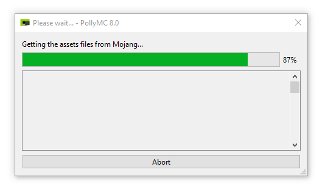

… until right around here where it says _Getting the assets files from Mojang_.

**17:** The loading bars are going to disappear after they’re finished. _Don’t touch anything, just wait._ The game will launch, but it may take anywhere from 20 seconds to a couple minutes. Don’t worry, it’s only this slow for the first time you install. After this, it’ll load much quicker each time.

**18:** By the way, you should now have a _Miladycraft_ program installed, which you can find with your command bar. Just hit cmd + space and search for Miladycraft.

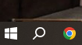

**1**9: If everything is running smoothly, after a bit of time this will pop up after the loading bars are all finished and disappeared.

\
\

20: For brand new accounts, a password menu will pop up. This is just asking you to create a password. Type whatever password you desire in the black box and then click Done when you’re finished. You won’t need to log in with your password on the same device every time you want to play, but it’s important to have it noted down somewhere in case you want to update your game or use the account on new devices.

\
\

21: It’s highly recommended you check out the Miladycraft Online Manual if it’s your first time playing. It’s a short guide that covers the most crucial basics, like how to talk on mic, set your custom skin, and protect your property. Give it a read, it’ll make life in Miladycraft much easier.

\
\

22: When you’re ready, click Multiplayer.

\
\

23: Select the Miladycraft server that’s already loaded in for you and click the big green play triangle.

\
\

24: This probably won’t happen but just in case, if you see something like this at any point, it’s just a minor connection issue. Try again a couple times. If it keeps happening, close the launcher, relaunch the game, and try again.&#x20;

\
\

\

25: Upon successful connection you WILL see this for the first time. Not to worry, this is the last step before you get to play. All you have to do now is link your Discord account on Milady Village to your Miladycraft account. If you’ve never visited Milady Village before, you can do so by going to [https://discord.com/invite/milady](https://discord.com/invite/milady) and joining the server. If you get any other error messages besides this or the previous one, please tag @michaeldragovic or @onno in the #miladycraft channel.

\
\

26: Once you’re in Milady Village Discord and you’ve gotten past the basic new user verification, go to any channel and type /verify in chat. As you’re typing, you’ll see a box with the word code pop in as soon as you hit the space bar after the word verify. Type in the number that appeared in the Miladycraft message telling you what your code is. In this example, the number was 3801. Your number will be different, pay attention and remember or write down your code before you go to Milady Village to verify. After you type in your code, hit enter to send the message. Don’t worry, it’ll only be visible to you.

\
\

27: Once you have verified successfully, go back to Miladycraft and try to play on the multiplayer server like before. You should load successfully into spawn and begin your great adventure!&#x20;

\
