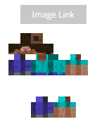
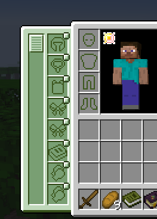
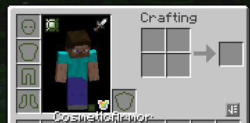
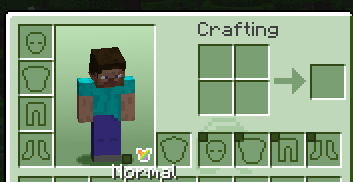
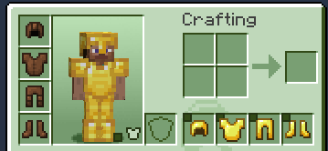
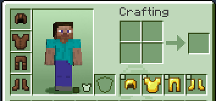

# Miladycraft Onboarding Guide

**Miladycraft Onboarding Guide:**

Miladycraft is an extensively curated and polished Minecraft modpack which has been in development since 2021, serving as a proof of concept minimum viable metaverse experience for the Milady community. Even Minecraft veterans may need some help navigating some of the new features Miladycraft offers. This guide is a must-read so you can maximize your Miladycraft experience:

_<mark style="color:yellow;">**At the very least, make sure you read the**</mark>** **<mark style="color:red;">**VOICECHAT, SHADERS, SKIN, & PROPERTY PROTECTION**</mark>** **<mark style="color:yellow;">**tips to get the most out of Miladycraft’s social features!!!**</mark>_

**Password:** Miladycraft utilizes offline accounts, which work through a launcher called PollyMC. When playing Miladycraft for the first time, it’ll ask you to input a password. This is the password creation process, _remember what you put in._ You won’t have to put it in again next time you play, but it’ll be important if you ever change devices or versions.

**Keybinds:** Just in case you didn’t know, you can remap any of the keys for any function in the game. Press _Escape_ and go to _Options… > Controls > Key Binds_ to open the keybinds menu. We recommend sticking with the configuration we’ve set for you until you get more familiar with the game mods, but you can change things here any time and use the search bar at the bottom to find keybinds quickly.

<mark style="color:red;">**Voicechat:**</mark> Miladycraft features proximity voicechat. When you start the game press _J_ to go through the setup process and enable your mic. We recommend always on. Once you’ve set your chosen mic and speaker, you can open the voicechat menu by pressing , (_comma key)_ where you can enable/disable voicechat or change mic settings any time, while the . (_period key)_ can now be used to automatically enable and disable. If you choose _push-to-talk_, the default key is _V,_ just hold it down while you talk into the mic.

<mark style="color:red;">**Shaders:**</mark> If you’re not playing with shaders, you’re not playing true Miladycraft. Press the _O_ key to open the shader menu. Select which one you want and click _Apply > Done._ Press _I_ to quick toggle shaders on/off and press _P_ to reload them quickly if needed. You can add other shaders to your preference but we recommend _Complementary Reimagined + Euphoria Patches_ as the default.

**Messages:** To type and send messages in game, press _T_ and hit _Enter_ after you’re done typing. This is also how to do commands. For example, sending the text _/spawn_ takes you back to Jade McDonalds where everyone first spawns in.

<mark style="color:red;">**Skin:**</mark> It’s recommended to pick a skin before you start playing so you can uniquely express yourself. You can find or upload skins on websites like [https://mineskin.org/](https://mineskin.org/),  [https://www.minecraftskins.com/](https://www.minecraftskins.com/) or [https://namemc.com/](https://namemc.com/). The name you chose when making your Miladycraft account will use the skin of the corresponding Mojang/Microsoft account name by default. To change your skin, use the _<mark style="color:yellow;">/skin</mark>_ command as follows:

Example:\
[_<mark style="color:yellow;">/skin set</mark>_](https://minesk.in/e27fc515b66349d2bd83ef1b8078907b) _<mark style="color:yellow;">web classic "</mark>_[_<mark style="color:yellow;">https://minesk.in/e27fc515b66349d2bd83ef1b8078907b</mark>_](https://minesk.in/e27fc515b66349d2bd83ef1b8078907b)_<mark style="color:yellow;">"</mark>_\

* The first option _<mark style="color:yellow;">set</mark>_ defines indicates that you're setting a skin. Other options include _<mark style="color:yellow;">clear</mark>_ which resets your skin to default.
* The second option _<mark style="color:yellow;">web</mark>_ indicates that you're applying your skin from a <mark style="color:red;">**direct link**</mark>**.** Other options include _<mark style="color:yellow;">mojang</mark>_ which lets you select a skin directly from your or someone's Mojang/Microsoft account; and _<mark style="color:yellow;">random</mark>_, which should be self-explanatory.
* The third option _<mark style="color:yellow;">classic</mark>_ indicates that this skin should use a default/Steve body. The other option is _<mark style="color:yellow;">slim</mark>_ which uses a slim/Alex body, which has thinner arms than the default body. If your chosen skin appears with discolorations on the arms or shoulders, then it is likely you have a default body skin that you tried to put on a slim body or vice versa , as the textures are slightly different between the two.
* The final option takes a <mark style="color:red;">**direct link**</mark> to the skin that you wish to use, and should be placed in between <mark style="color:yellow;">**"**</mark><mark style="color:red;">**double quotes**</mark><mark style="color:yellow;">**"**</mark> like these. You will know it is a direct link when it directly displays the .PNG file of your skin in browser, or prompts to download said file (or if the website tells you to.) \
  \-> You can also upload your skin directly in the Milady Village channel meant for it, and copy the link!

Other examples:\
[_<mark style="color:yellow;">/skin set</mark>_](https://minesk.in/e27fc515b66349d2bd83ef1b8078907b) _<mark style="color:yellow;">web slim "</mark>_[_<mark style="color:yellow;">https://s.namemc.com/i/0077769afa9a56f3.png</mark>_](https://s.namemc.com/i/0077769afa9a56f3.png)_<mark style="color:yellow;">"</mark>_\
_<mark style="color:yellow;">/skin set mojang popbob</mark>_\
_<mark style="color:yellow;">/skin set random</mark>_\
_<mark style="color:yellow;">/skin clear</mark>_

Once you’ve applied the skin by typing the command and hitting _Enter_, you will see that your skin is being processed. If successful, you will be requested to relog so that your skin may appear.

Any online link to an image file can be used as a skin, even links to images sent as Discord messages! Make sure the image looks something like this to apply the skin correctly:

**POV:** To check yourself out, you can switch your camera perspective by pressing _F5_. Each time you press, it switches between 1st person, 3rd person behind, 3rd person front, and 3rd person over the shoulder. You can toggle all GUI info by pressing _F1_ and you can take screenshots that save to your computer by pressing _F2._ You can click the screenshot links that pop up in chat to open your screenshot folder. Press _Z_ to zoom.

**Map:** You’ll notice there’s a minimap in the corner of the screen, giving you a top down navigational aid. Press _Y_ to change settings on it as you need. To look at the world map, press _M._ You’ll only be able to see what you’ve discovered for yourself!

**Waypoints:** You can add waypoints in the game to help you mark notable locations. You can do this in several ways:

* <mark style="color:yellow;">Opening the world map and right clicking any spot gives you a menu where you can add waypoints. (Teleporting is disabled, sorry not sorry, deal with it.)</mark>
* <mark style="color:yellow;">Pressing</mark> <mark style="color:yellow;"></mark>_<mark style="color:yellow;">U</mark>_ <mark style="color:yellow;"></mark><mark style="color:yellow;">opens the full waypoint menu, where you can edit, add, delete, or simply disable your waypoints if you just don’t want to see them. Adding a waypoint will, unless specified otherwise, place it on your current location.</mark>
* <mark style="color:yellow;">Pressing</mark> <mark style="color:yellow;"></mark>_<mark style="color:yellow;">+</mark>_ <mark style="color:yellow;"></mark><mark style="color:yellow;">on your</mark> <mark style="color:yellow;"></mark>_<mark style="color:yellow;">Numpad specifically</mark>_ <mark style="color:yellow;"></mark><mark style="color:yellow;">automatically places a quick waypoint for you</mark>
* <mark style="color:yellow;">When you die in game, a death waypoint is made for you so you can go back and get your stuff. There’s also a tombstone mod that holds everything for you conveniently so you can right click it and get your inventory back just the way you had it. Be warned, other players can steal it too…</mark>

**Items:** When you press _E,_ you open the inventory and crafting menu. You’ll notice a huge swathe of blocks and items to the right. This is a mod called JEI, Just Enough Items. It contains every block and item in the game. You can flip through the pages with the arrow keys or search for specific items using the search bar. You can search specific mod items by putting @ before the modpack name.

* <mark style="color:yellow;">Clicking on an item in the JEI menu shows you how it can be crafted or found.</mark>
* <mark style="color:yellow;">Right-clicking an item in JEI shows you what recipes you can use the item in.</mark>
* <mark style="color:yellow;">Looking at blocks, items, and entities in game will display what they are for you at the top of the screen, you can toggle this on and off by pressing</mark> <mark style="color:yellow;"></mark>_<mark style="color:yellow;">Ctrl + L.</mark>_

**Curios:** You will periodically find items in game which will give you attributes, abilities, and powers. You can wear them alongside your usual armor slots via the _Curio Menu._ To open this menu, open your inventory by pressing _E_ and click on the star on the upper left part of the avatar display. You can apply or remove curios, attachments, and accessories along any slot in the green menu.

**Cosmetic Armor:** In the bottom right section of the avatar display in your inventory menu, you’ll see a little shirt icon. When you click it, it opens up _cosmetic slots_ which allow you to visually override whatever armor you’re wearing. Keep in mind, anything in the _cosmetic slots_ does NOT give you extra protection or enchantment, it’s purely for cosmetic purposes, as the name suggests.

 

There are little boxes in the top left corner of each slot, when you click them, you’re toggling each slot to show nothing, no matter if there’s armor in your armor slot OR your cosmetic slot. This is a quick way to show off your skin or hide your armor from other players in sneaky PvP situations.

 

**Movement:** Miladycraft has introduced multiple different movement mechanics for both mechanical functionality and aesthetic roleplay.

* As a vanilla refresher, double tap _W_ to sprint or you can tap _Ctrl_ to do the same. “Sprinting” underwater lets you swim around more effectively.\
  \- Autowalk by pressing ‘ _(apostrophe key)._
* You can sit on any surface by pressing _Shift + H_ and repeating the command to stand again. (If you find your perspective “dipping” when you stand still, it’s probably because you left your “sit” toggled on.)
* You can crawl anywhere and through any one block space by holding down _X._
* Dance!!! Press _G_ to open a menu where you can select poses and dance loops.

**Parkour:** Along with these movement additions, the _Parcool_ mod introduces a range of new exciting features for accelerated movement. A guide should be present in the new player starterkit you spawned with. Scroll through your in-hand inventory and when you’re holding the blue book, right click to read through all the cool flips, wall runs, ledge hangs, and dodge rolls you can do.

**Starterkit & Guides:** If you manage to lose your starterkit, you can always get another one by using the command _<mark style="color:yellow;">/kit starter</mark>_ ingame. The books it provides are highly informative. Aside from the parkour guide, here are some of the others:

* _Animal Dictionary_ is a green book which explains all the new animals and creatures added by _Alex’s Mobs._ You can gain powerful and mysterious items by interacting with them in different ways, and you can even tame some of them to become amazing pets!
* _Lexicon of Minecraft_ is a purple book which explains how vanilla Minecraft works. If you’ve never played Minecraft before but you want to experience Miladycraft, this book can be a decent refresher on what to do. Keep in mind some of the information is out of date because mods changed a couple mechanics.
* _Iron’s Guidebook_ is a silver-blue helpful guide on the brand new magic system. You can cast powerful spells and build magical armor and weapons. HIGHLY recommend getting into magic in Miladycraft.

Here are some other useful guides that aren’t in the starterkit. Look their names up in JEI and click on them to learn how to craft them:

* _Decorating Your Home_ is a red book that explains one of the several furniture mods.
* _Trader’s Manual_ is a teal book that explains how to set up trading stations so you can run a store that other players can exchange items with.
* _Chronicle of Shadows_ is a purple and gold book that explains the _Apotheosis_ mod, which allows you to enhance enchanting, gardening, and alchemy while fighting new powerful bosses. It is HIGHLY recommended you get into this mod as well, especially if you want to PvP other players.
* _Skating Made Simple_ is an orange book that teaches you how to start building skateboards and doing cool tricks with them.

<mark style="background-color:red;">**Property Protection:**</mark> Miladycraft uses a mod called _Flan_ for property protection. Each player is allotted a limited number of blocks they can use when making a square claim. Inside a player’s claim, they are protected from PvP unless they choose to opt in by returning damage. Your claim will not protect you from mobs, that’s still up to you to build a home and keep it well lit. However, your claim DOES protect your build from any kind of explosion damage, and also makes certain that nobody can break blocks or steal items from your chests. Miladycraft _however_ has it set that doors cannot be locked, for the sake of exploration and socializing, so if you have dirty secrets you better hide them or block them off from prying eyes.

* To make a claim, first obtain claiming tools by using the command <mark style="color:yellow;">/kit claimtools</mark> which will give you a <mark style="color:yellow;">Claim Tool</mark> and a <mark style="color:yellow;">Claim Inspector</mark>. Use the <mark style="color:yellow;">Claim Inspector</mark> to check whether there already is a claim at the location you're trying to claim at. Use the <mark style="color:yellow;">Claim Tool</mark> to start your prospective claim selection.
* Follow the prompts in chat to make sure your claim was successful, colored smoke will appear to denote the borders and corners of your selection. You can resize your claim by clicking a corner of it with the <mark style="color:yellow;">Claim Tool</mark>, and selecting a new spot. The smoke-markers will appear whenever you’re inside your claim with golden hoe in hand.
* You can use the command _<mark style="color:yellow;">/flan</mark>_ whilst inside your claim to configure permissions for who can do what in your claim, or delete the claim entirely. Visit [https://github.com/Flemmli87/Flan/wiki](https://github.com/Flemmli87/Flan/wiki) for more information about how to use the _Flan_ property protection mod.

**Leaving Spawn:** In spawn, north of the Remilia Smiley pavilion, you’ll find a lovely rendition of the iconic Jade McDonald’s, nestled between cherry blossom trees atop the peak of Mt. Milady. Within the entirety of this region, you will be protected from all damage. You can visit the dessert room immediately to your right when you get to the top of the steps and enjoy free, infinitely respawning cakes, pies, tarts, and pastries to replenish your hunger. Feel free to explore the depths of the Jade McDonald’s and the top of Mt. Milady, where you can go inside the golden Remilia Sphere that overlooks all of Miladycraft.

Below the Remilia Smiley pavilion is the entrance to the Lucky Dragon Casino, where you can gamble Miladybucks to your heart’s content and possibly win fabulous collectible cosmetic prizes. Go down the south facing steps along either descending path and loop back towards under the smiley where the entrance is.

To exit spawn, you can go down the south, west, or eastern paths that descend down to ground level. After walking a dozen or so blocks away from the path’s exits, you should be able to now modify blocks and interact with the world to your heart’s content. Be advised though that you are now vulnerable to hunger, damage, and all of what Miladycraft has in store for you. To return to spawn any time, type the command _/spawn._

To the east of spawn and a tad south, there’s an island with a zen garden, pagoda, and floating island waterfall. This was the old “Jade McDonald’s” spawn back when Miladycraft was purely a vanilla Minecraft server. Feel free to check it out!

**Exploration Tips:** When navigating throughout the world, here are some helpful tips and things you should know:

* Giant structures that look like they could be player-built but are filled with hostile mobs are actually _Dungeons._ They contain fabulous treasures but are also a lot more dangerous than you’d think. Be extremely careful when you enter and don’t bring items that you’ll get frustrated with losing, it can be hard to fight through mobs to recover stuff.
* Many new animals have been added. Definitely consult the animal dictionary on which ones are hostile or docile. Don’t just kill them for stuff, some of the items they drop are only given through special interactions.
* While there’s no _<mark style="color:yellow;">/home</mark>_ command, waystones have been added throughout the map to allow for easier transportation to familiar locations. You have to unlock them by right clicking, but once you do, any waystone can teleport to any other discovered waystone. (There’s a free one inside the Remilia Sphere at the top of Mt. Milady by spawn!)
* Chests with gold trims on them are called _Lootr_ chests, they create player specific inventories for everyone. This means everyone can loot the same chests and all get something out of it. Be kind and don’t destroy the chests so other players can loot them too.
* Players are usually friendly in Miladycraft (at the time of writing, at least). PvP is overhauled so it’s quite likely that if you’re new to Miladycraft and you try to attack a player experienced at the game, there is a significant chance they will kill you. Netherite enchanted is not the best gear anymore, and there is a whole system of firearms, new weapons, and potent magical spells you should become acquainted with first.
* Miladycraft chat feeds directly into a channel on Milady Village Discord where players can speak to Discord users directly in game. This means everything you type in Miladycraft text chat gets saved to a publicly viewable channel. Voice chat has not yet had any surveillance measures revealed to the public so it might be a better option if you’re trying to keep secrets. You can always type _/msg “_name_”_ to privately DM.
* You can jump in boats! Hold the space bar while in a boat to jump over annoying obstacles. You can also craft obsidian boats to float through lava lakes, but they sink in water and don’t jump.
* Use JEI to scroll through items and recipes, this is how you can learn more about the game and develop goals to pursue. We recommend using the @name search function as well to search through specific modpacks.
* Look up “sack” and “backpack” in JEI. You can use the sacks as a low grade type of shulker box to carry extra items, but you can only have two in your inventory before you get encumbered. A backpack can be worn in the backpack curio slot and gives you a decent extra inventory with no penalties. You access it when worn by pressing _B._

**Mods:** Here are a couple JEI search tags for mods we think you’d really be interested in:

\
_**Food and Farming**_

_<mark style="color:yellow;">@delight | @brewin | @respite | @beer | @drinkbeer | @neapolitan</mark>_

These mods encompass some of the extensive amount of agriculture and food additions we’ve added to Miladycraft, centered mainly around _Farmer’s Delight_ and its many expansions. Dozens of new plants to farm and over 200 new food & beverage items with complex preparation methods have been added here.

_**Mail and Trading**_

_<mark style="color:yellow;">@mighty | @wares | Trading Station</mark>_

_Mighty Mail_ is a mod that allows you to create your own mailboxes and post boxes for receiving and sending packages to other players. _Wares_ allows you to craft delivery agreements for items sold in bulk. The _trading station_ from the _Adorn_ mod allows you to passively sell items to any passing player interested in the deal you display.

_**Media**_

_<mark style="color:yellow;">@etch | @paint | @expo | @music | @melo</mark>_

_Etched_ is our music mod. It allows you play music directly from any mp3 link online, with ingrained Soundcloud and Bandcamp support! You can loop songs on stationary radios or carry it with you in handheld ghetto blasters, or etch custom record discs and jukeboxes to play your very own in-game playlists!

_Joy of Painting_ allows you to paint pixel art on canvases and place the finished paintings anywhere you choose, while _Immersive Paintings_ allows for custom images off your computer to be placed and displayed on any surface of the game, akin to sprays in Counterstrike.

_Xerca’s Music Mod_ gives you MIDI keyboard instruments to torture your friends with, but you can also create custom songs using the music sheet, with a built in music maker GUI, and share finished music or play it off a music box. _Immersive Melodies_ lets you play instruments more roleplay/atmospheric style with pre-canned songs that do all the work for you while your character just animates.

_**Furniture and Decor**_

_<mark style="color:yellow;">@deco | @adorn | @compat | @furn | @wood | @vibes | @wind | @arch | @clay | @glass | @doors | @envi | @sully | @aqua | @cave | @atmos | @opule | @banner</mark>_

Builders have never had it better with hundreds of new blocks, decor, and furniture.

_**Quark and Supplementaries**_

_<mark style="color:yellow;">@quark | @suppl</mark>_

These two mods alone add hundreds of new decorative blocks, but they also add a variety of new functional features, fixes, and optimizations to the game which are worth diving into. Check them out for yourself, it may come in handy: [https://quarkmod.net/#features](https://quarkmod.net/#features)\
[https://www.youtube.com/watch?v=Qt2UkAojgAw](https://www.youtube.com/watch?v=Qt2UkAojgAw)

_**Fun!!!!!**_

_<mark style="color:yellow;">@skate | @chalk | @table | @casino | @snow | @hats | @parcool</mark>_

Chalk symbols on walls, play chess, ConnectFour, TicTacToe, gamble in casino games, play arcade games, skateboard, sled, and wear cool hats! Jump around and do parkour tricks! Yay!

_**Pets**_

_<mark style="color:yellow;">@domes | @mobs</mark>_

The _Domestication Innovation_ mod is extremely important to use if you intend on having any tamed pets. Not only does it guarantee their functional immortality by giving them a respawn mechanic through pet beds, but it also allows you to imbue them with enchantments that give you and your pet potent abilities and even magical powers. _Alex’s Mobs_ also contains many animals that are tameable and cross compatible with _Domestication Innovation._

_**Transportation**_

_<mark style="color:yellow;">@auto | @air | @boat | @cart | @traf</mark>_

You can craft car parts and assemble vehicles now with the _Auto Mechanical Table,_ fly planes, add utility to boats, use an EXTENSIVE new level of minecart and railway accessories, and build the infrastructure for all with a functional decor traffic mod that adds signs, roads, utility equipment, and real traffic lights.

_**Violence**_

_<mark style="color:yellow;">@arti | @gun | @iron | @armor | @apoth | @sava | @cavern | @gateway | @weapon</mark>_

_Iron’s Spells_ and _Apotheosis_ will get you brushed up on a variety of magic mechanics while several gun mods, armor mods, weapon mods, and full content expansion mods will give you plenty to pack your arsenal with.

_**Portable Crafting Table**_

_<mark style="color:yellow;">@crafting</mark>_

This mod allows you to craft a portable crafting table.

**Advancements:** When you press _Escape_ to open the game menu, go to _Advancements_ tab. In here you will see several charts of different achievements you can get per different mod, including of course, vanilla Minecraft. This is a great place to look if you find yourself uncertain about what to do next.

Of course there is the inevitability of having accomplished everything in the _Advancements_ tab, voraciously consuming every little badge until the dopamine drip runs dry and you come to terms with having exhausted all potential avenues of being purely a consumer, a chasm of needs to be filled by basic structural expectations and colorful little goals to checkmark.

You then have to face the infinite, an ever expanding world of possibilities that come from embracing creativity and interacting with other players. It can be daunting I’m sure, looking out into the great beyond of unfinished business that expands into the world and the Network at far greater pace than you could ever hope to catch up with.

There is always a megaproject waiting to be built. There is always a perfect cross section of imagery and music to port into the game as an announcement of your superior subtle taste. There is always fully embracing roleplay with more props than a Minecraft vanilla player could ever hope to dream of shoddily imitating with large blocky fabrications. A cooked sandwich handed dutifully to a friend sitting at a table. A police car chase with siren noises looped in through a handheld stereo. The frequently held Milady Movie Nights where everyone gathers in a large theater to watch live synchronized video streaming on the big screen. A gentle bomb dropped from a plane.

There is always an event looming around the corner, a grand ball or a rave with a full array of dancing. There is always the quiet gossip between you and an acquaintance as you wander aimlessly through caves and tunnels. There is always the promise of quiet moments to yourself, organizing chests, fishing, or simply just walking around your property as music blasts in from a disc, interrupted by a single transdimensional “hello” out through the Miladycraft Discord channel. You type “hello” back. If none of this provides solace to the troublesome hunger for preoccupation, then there is always the absolute comfort of impending violence, the steady incline of stat, strength, and strategy as you prepare to lay waste to whomever is unfortunate enough to be alive outside the safety of a claim in hopes that at least one will give you a great battle.

Throughout the ebbs and flows of fortune and trial that life has to offer, amidst the lows of NEET spartan poverty, among the highs of euphoric grindstone productive wealth, and in between both during all of life’s little moments of boredom, curiosity, and idleness, there is always Miladycraft. _**We’ll see you at the Jade McDonald’s <3**_
